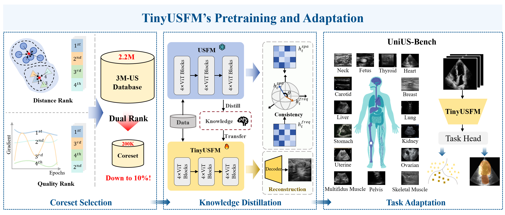

# TinyUSFM: Towards Compact and Efficient Ultrasound Foundation Models

[]()
[](LICENSE)

This repository provides the **official PyTorch implementation** of **TinyUSFM — the first lightweight ultrasound foundation model** designed for efficient and deployable medical AI.

TinyUSFM achieves foundation-level representation capability with only **5.5M parameters** and **2.16 GFLOPs**, serves as the **official lightweight continuation** of our last work [Ultrasound Foundation Model(USFM)](https://github.com/openmedlab/USFM), preserving its generalization ability while enabling efficient deployment across diverse ultrasound applications.

> 🏆 *TinyUSFM achieved **1st Place** in the MICCAI 2025 Intrapartum Ultrasound Grand Challenge (IUGC).*  
> 🧩 *We release **UniUS-Bench**, the largest public ultrasound benchmark covering 15 organs.*  
> ⚙️ *This repository also **fixes and improves** the segmentation settings of [USFM](https://github.com/openmedlab/USFM).*
> 
---

## 🧩 Overview

<p align="center">
  
</p>

**Key Features**
- 🧠 **Feature–Gradient Driven Coreset Selection** — Curates high-quality, diverse ultrasound samples for efficient distillation.  
- 🔄 **Domain-Separated Masked Image Modeling** — Preserves spatial and frequency representations critical for ultrasound.  
- ⚖️ **Consistency-Driven Dynamic Distillation** — Transfers reliable teacher knowledge with adaptive weighting.  
- ⚡ **Efficient Deployment** — Matches USFM performance with only 6% of parameters and computation.

---

## ⚙️ Installation

```bash
# Clone this repo
git clone https://github.com/MacDunno/TinyUSFM.git
cd TinyUSFM

# Create environment
conda create -n tinyusfm python=3.12
conda activate tinyusfm

# install pytorch according to instructions
# https://pytorch.org/get-started/
pip install torch==2.6.0 torchvision==0.21.0 torchaudio==2.6.0 --index-url https://download.pytorch.org/whl/cu126

# Install dependencies
pip install -r requirements.txt
```

---

## 🧠 UniUS-Bench
##  UniUS-Bench Dataset

**UniUS-Bench** integrates 8 classification and 10 segmentation datasets (≈60,940 images, 15 organs) for standardized evaluation of ultrasound foundation models.

| Dataset | Organ(s) | #Images | Link |
|:--------------------------|:------------------|:-----------:|:----------------------------------------------------------|
| CUBS | Carotid artery | 1,378 | [mendeley](https://data.mendeley.com/datasets/m7ndn58sv6/1#:~:text=Here%20we%20provide%20the%20entire%20dataset%20%28500%20images%2C,Computers%20in%20Biology%20and%20Medicine%2C%202022%20%28DOI%3A%20https%3A%2F%2Fdoi.org%2F10.1016%2Fj.compbiomed.2022.105333%29.) |
| UF1990 | Uterus | 1,990 | [mendeley](https://data.mendeley.com/datasets/552zbvzwrk/1) |
| TN3K | Thyroid | 3,491 | [github](https://github.com/haifangong/TRFE-Net-for-thyroid-nodule-segmentation) |
| STMUS | Skeletal muscle | 5,312 | [mendeley](https://data.mendeley.com/datasets/3jykz7wz8d/1) |
| AUL | Liver | 735 | [zenodo](https://zenodo.org/records/7272660) |
| BUSI | Breast | 780 | [homePage](https://scholar.cu.edu.eg/?q=afahmy/pages/dataset) |
| MMOTU | Ovarian | 1,469 | [github](https://github.com/cv516Buaa/MMOTU_DS2Net) |
| Fetal Planes | Fetus | 12,400 | [zenodo](https://zenodo.org/records/3904280) |
| Luminous | Multifidus muscle | 341 | [homepage](https://users.encs.concordia.ca/~impact/luminous-database/#:~:text=This%20database%20provides%20the%20US%20ground%20truth%20of,%2864%20males%2C%2045%20females%2C%20age%3A%2021.1%20%C2%B1%201.7%29.) |
| KidneyUS | Kidney | 487 | [github](https://github.com/rsingla92/kidneyUS) |
| GIST514 | Stomach | 514 | [github](https://github.com/howardchina/query2) |
| DDTI | Thyroid | 637 | [github](https://github.com/openmedlab/Awesome-Medical-Dataset/blob/main/resources/TN3K.md) |
| BUSBRA | Breast | 1,875 | [github](https://github.com/wgomezf/BUS-BRA) |
| NerveSeg | Neck nerve | 5,735 | [kaggle](https://www.kaggle.com/competitions/ultrasound-nerve-segmentation) |
| LUSS | Lung | 564 | [Leeds](https://archive.researchdata.leeds.ac.uk/1263/) |
| FH-PS-AoP | Pelvis | 4,000 | [zenodo](https://zenodo.org/records/10902237) |
| CAMUS | Cardiac | 19,232 | [insa-lyon](https://humanheart-project.creatis.insa-lyon.fr/database/#collection/6373703d73e9f0047faa1bc8g) |

---

## 🚀 Usage

### 🔗 Installing Model Weight
 #### Pretrained **TinyUSFM** weights: [Google Drive](https://drive.google.com/file/d/15R3hnH0ILO39rE1gs-UgJonRqbaYTSRB/view?usp=sharing)
 #### Pretrained **USFM** weights: [Google Drive](https://drive.google.com/file/d/1KRwXZgYterH895Z8EpXpR1L1eSMMJo4q/view)

### 🩺 Downstream Classification
```bash
python train_cls.py --model_name TinyUSFM # or USFM
```

### 🧩 Downstream Segmentation
```bash
 python train_seg.py --model_name TinyUSFM_Seg # or USFM_Seg
```

---

## 📝 License
This project is licensed under the **Apache 2.0 License**.  
See [LICENSE](LICENSE) for details.

---

## 📚 Citation

If you find this work useful for your research, please cite:

```bibtex
@misc{ma2025tinyusfmcompactefficientultrasound,
      title={TinyUSFM: Towards Compact and Efficient Ultrasound Foundation Models}, 
      author={Chen Ma and Jing Jiao and Shuyu Liang and Junhu Fu and Qin Wang and Zeju Li and Yuanyuan Wang and Yi Guo},
      year={2025},
      eprint={2510.19239},
      archivePrefix={arXiv},
      primaryClass={eess.IV},
      url={https://arxiv.org/abs/2510.19239}, 
}

@article{jiao2024usfm,
  title={Usfm: A universal ultrasound foundation model generalized to tasks and organs towards label efficient image analysis},
  author={Jiao, Jing and Zhou, Jin and Li, Xiaokang and Xia, Menghua and Huang, Yi and Huang, Lihong and Wang, Na and Zhang, Xiaofan and Zhou, Shichong and Wang, Yuanyuan and others},
  journal={Medical image analysis},
  volume={96},
  pages={103202},
  year={2024},
  publisher={Elsevier}
}

@inproceedings{ma2025unlabeled,
  title={Unlabeled Data-Driven Fetal Landmark Detection in Intrapartum Ultrasound},
  author={Ma, Chen and Yunshu, Li and Guo, Bowen and Jiao, Jing and FDU, Huang Yi and Wang, Yuanyuan and Guo, Yi},
  booktitle={MICCAI 2025 IUGC Challenge}
}
```


---

## 📬 Contact
For any questions, please feel free to contact:
cma24@m.fudan.edu.cn